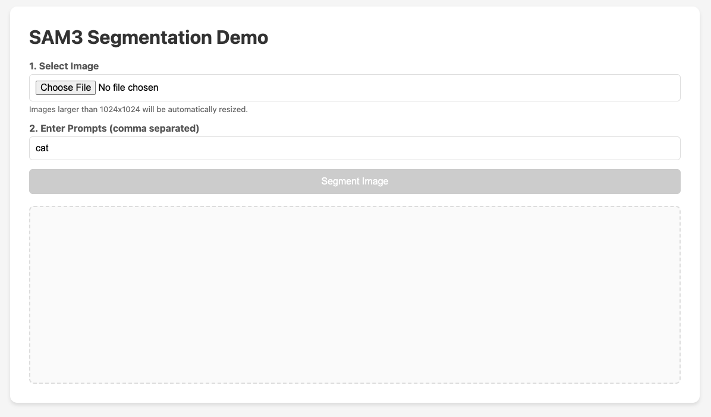
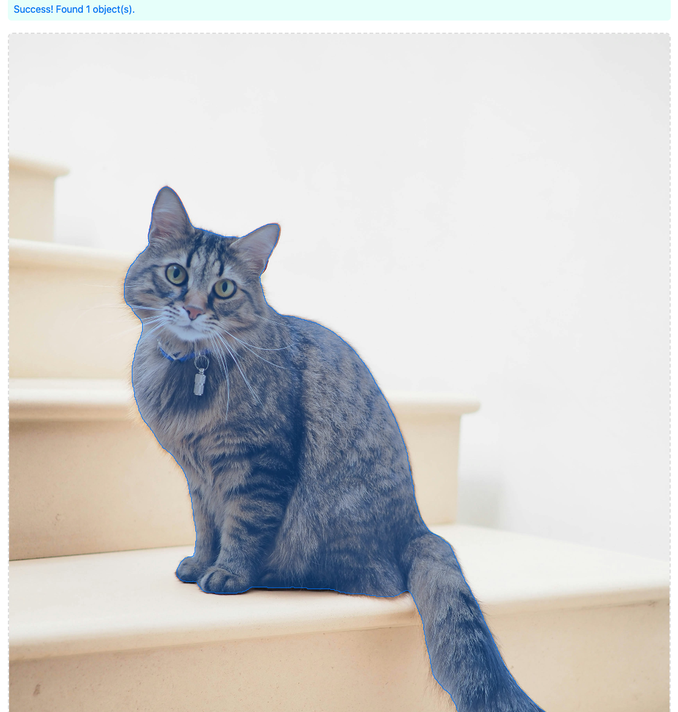
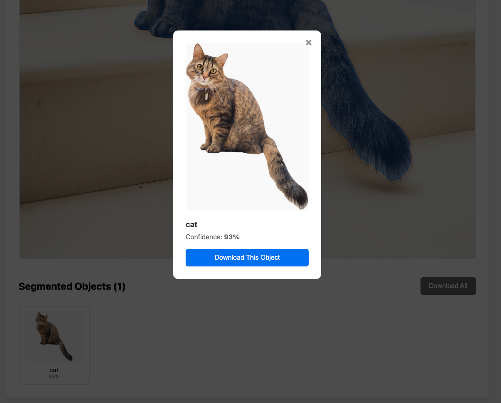

# SAM3 API Node.js Demo

A complete Node.js application demonstrating how to integrate the SegmentLens SAM3 API for image segmentation.  
This demo includes both backend API integration and an interactive frontend with object visualization and download capabilities.

---

## About SegmentLens

SegmentLens provides an HTTP API for running image segmentation using Meta's Segment Anything Model 3 (SAM3).  
This repository is a **technical example** of how to call the API from a Node.js application and build a simple UI around it.

## Screenshots

You can add screenshots like:





## Quick Start

### Prerequisites

- Node.js v14 or higher
- SAM3 API key (generated from your SegmentLens account settings)

### Installation

```bash
git clone https://github.com/segmentany/sam3-nodejs-demo
cd sam3-nodejs-demo
npm install
```

### Configure Your API Key

```bash
cp .env.example .env
```

Edit `.env` and set:

```bash
SAM3_API_KEY=sk_live_your_actual_api_key_here
```

### Start the Server

```bash
npm start
```

Then open:

```text
http://localhost:3000
```

---

## How It Works

### 1. Backend (`server.js`)

The backend is a small Express server that:

- Exposes an endpoint for the frontend to send images and prompts
- Forwards requests to `https://sam3.ai/api/v1/segment`
- Adds the `Authorization: Bearer <SAM3_API_KEY>` header
- Returns the raw API response to the browser
- Supports larger JSON payloads (base64-encoded images)

This design keeps your API key on the server side and out of the browser.

### 2. Frontend (`public/index.html`)

The frontend is a static HTML page (no framework required) that:

1. **Image upload and preprocessing**

    - Accepts image files via `<input type="file">`
    - Resizes images larger than 1024×1024 while preserving aspect ratio
    - Converts the resized image to base64 and records the scale factor

2. **API request**

    - Sends a POST request to the backend with:
        - base64-encoded image
        - an array of text prompts (e.g. `["cat", "dog"]`)
    - Handles error responses and shows simple messages to the user

3. **Visualization**

    - Draws the original image on a canvas
    - For each mask polygon in the API response, scales coordinates back to the original resolution
    - Renders semi-transparent overlays and borders for each object

4. **Object extraction and download**

    - Uses polygon clipping to isolate individual objects
    - Renders each object into an off-screen canvas
    - Generates PNG blobs that can be downloaded:
        - individually
        - or all at once (e.g. via multiple downloads / zip step if you extend it)

---

## API Reference (used by this demo)

### Endpoint

```text
POST https://sam3.ai/api/v1/segment
```

### Headers

```text
Content-Type: application/json
Authorization: Bearer sk_live_...
```

### Request Body Example

```json
{
  "image": "base64_encoded_image_string",
  "prompts": ["cat", "dog", "sunglasses"]
}
```

### Response Example

```json
{
  "prompt_results": [
    {
      "echo": { "text": "cat" },
      "predictions": [
        {
          "label": "cat",
          "confidence": 0.98,
          "masks": [
            [[100, 100], [150, 100], [150, 150], [100, 150]]
          ]
        }
      ]
    }
  ]
}
```

### Typical Limits (example values)

- Max resolution: 1024×1024
- Max payload: ~2 MB (base64)
- Rate limit: about 10 requests/second per user

Check the official documentation for the most up-to-date limits:

```text
https://sam3.ai/docs/api-reference
```

---

## Customization

### Change Server Port

In `server.js`:

```js
const PORT = process.env.PORT || 3000; // change default port if needed
```

### Change Maximum Image Size

In the frontend script (e.g. in `public/index.html`):

```js
const MAX_SIZE = 1024; // adjust max dimension if your use case requires it
```

### Adjust Visualization Style

In the canvas drawing function, you can modify colors and styles:

```js
ctx.fillStyle = "rgba(0, 112, 243, 0.3)"; // mask fill color
ctx.strokeStyle = "#0070f3";              // mask border color
ctx.lineWidth = 3;                        // border width
```

---

## Troubleshooting

### “Unauthorized” or 401

- Verify `SAM3_API_KEY` is set in `.env`
- Ensure the key is valid and active
- Restart the server after changing environment variables

### “Image too large” or 413

- The API enforces a maximum image size and payload size
- The demo already resizes images, but extremely large images may still exceed limits
- Try with a smaller source image or reduce `MAX_SIZE`

### “Rate limit exceeded”

- You are sending requests too quickly with the same key
- Add simple throttling or queuing on the client side

### Server does not start

- Check whether port `3000` is already in use
- Try changing `PORT` in `server.js`
- Ensure dependencies are installed with `npm install`

### No objects found

- Try different prompts (e.g. `"person"`, `"car"`, `"tree"`)
- Confirm the uploaded image actually contains the requested objects
- Inspect network tab in your browser devtools for API errors

---

## Code Structure

```text
sam3-nodejs-demo/
├── server.js           # Express backend
├── package.json        # Dependencies and scripts
├── .env.example        # Environment variables template
├── .env                # Local environment (not committed)
├── .gitignore          # Git ignore rules
└── public/
    └── index.html      # Frontend single-page app
```

---

## Contributing

Issues and pull requests are welcome.  
You can:

- Report bugs with reproducible steps
- Suggest improvements to the demo
- Submit pull requests with enhancements or fixes

---

## License

This project is licensed under the MIT License.
